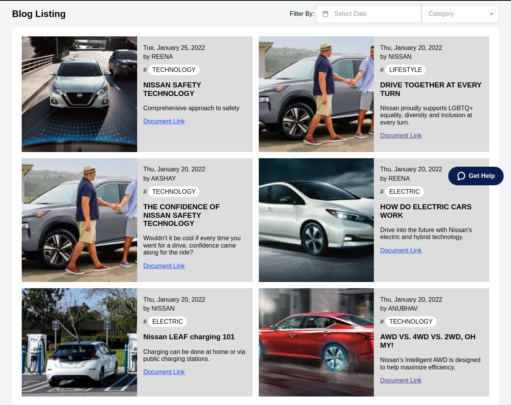

# CUSTOM BLOG LISTING

<!-- DOCS-IGNORE:start -->
<!-- ALL-CONTRIBUTORS-BADGE:START - Do not remove or modify this section -->
[](#contributors-)
<!-- ALL-CONTRIBUTORS-BADGE:END -->
<!-- DOCS-IGNORE:end -->

This app will render the blog listing in a custom app, on passing some mandatory props to the block it will fetch the data directly from the Master data and renders on blog listing page.



## Configuration 

In this section, you first must **add the primary instructions** that will allow users to use the app's blocks in their store, such as:

1. Adding the app as a theme dependency in the `manifest.json` file:
  ```json
  "dependencies": {
      "echidna.custom-blog-listing": "0.x"
  }
  ```

2. Create a custom page by adding the following code in `routes.json`:
  ```json
  "store.custom#blog-listing-page": {
    "path": "/blogs"
  }
  ```

3. Create a block file inside `store/blocks` with name  `blog-listing-page.jsonc`.

4. Add the following code inside `blog-listing-page.jsonc`:
  ```json
  {
    "store.custom#blog-listing-page": {
      "blocks": ["custom-blog-listing"]
    },
    "custom-blog-listing": {
      "props": {
          "accountName": "accountName",
          "entityIdAcronym": "entityIdAcronym",
          "schemaName": "schemaName"
      }
    }
  }
  ```

Next, add the **props table** containing your block's props. 

If the app exports more than one block, create several tables - one for each block. For example:

### `custom-blog-listing` props

| Prop name    | Type            | Description    | Default value                                                                                                                               |
| ------------ | --------------- | --------------------------------------------------------------------------------------------------------------------------------------------- | ---------- | 
| `accountName`      | `string`       |  Provide the account name used in project.  | `undefined`        |
| `entityIdAcronym`      | `string`       |  Acronym name of the master data entity.  | `undefined`        |
| `schemaName`      | `string`       |  Name of the master data schema used to create Blogs.  | `undefined`        |

 
## Customization

In order to apply CSS customizations in this and other blocks, follow the instructions given in the recipe on [Using CSS Handles for store customization](https://vtex.io/docs/recipes/style/using-css-handles-for-store-customization).


| CSS Handles |
| ----------- | 
| `noBlogsFoundContainer` | 
| `blogListingWrapper` | 
| `blogs` | 
| `imageWrapper` | 
| `contentWrappper` |
| `date` |
| `author` |
| `category` |
| `blogTitle` |
| `shortDescription` |
| `blogPageContainer` |
| `blogsListingContainer` |
| `blogsListingHeader` |


<!-- DOCS-IGNORE:start -->

## Contributors ✨

<!-- ALL-CONTRIBUTORS-LIST:START - Do not remove or modify this section -->
<!-- prettier-ignore-start -->
<!-- markdownlint-disable -->
<table>
  <tr>
    <td><a href="https://github.com/anubhav-parihar-work"><br /><sub><b>Anubhav Parihar</b></sub></a><br /></td>    
  </tr>
</table>

<!-- markdownlint-enable -->
<!-- prettier-ignore-end -->
<!-- ALL-CONTRIBUTORS-LIST:END -->

<!-- DOCS-IGNORE:end -->

